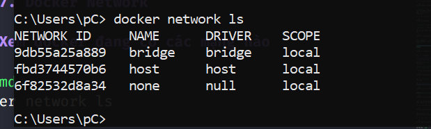
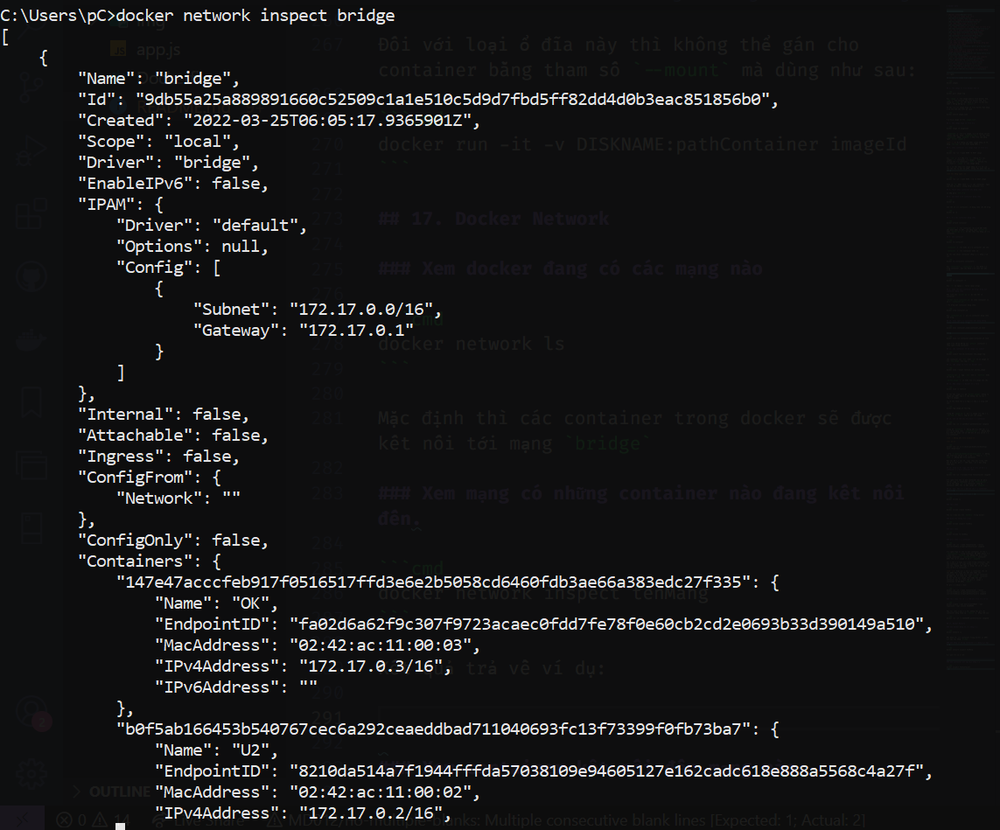
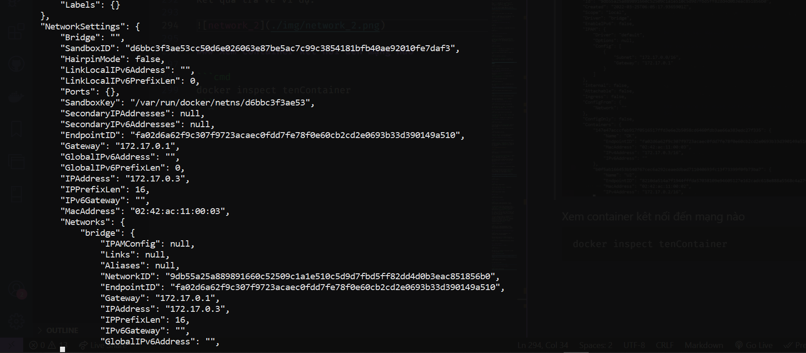
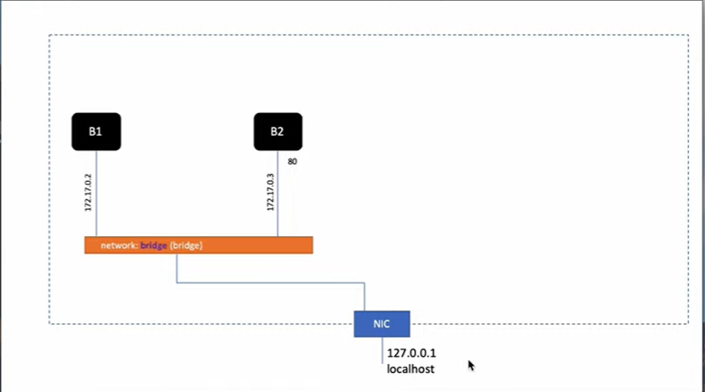
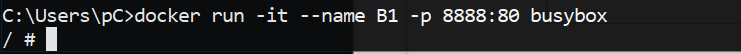
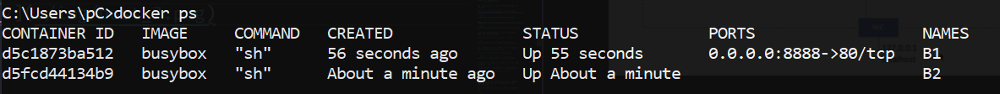
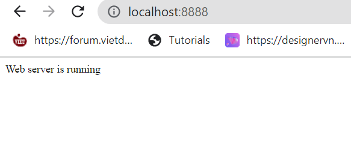
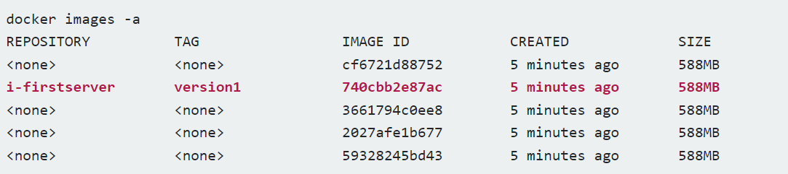
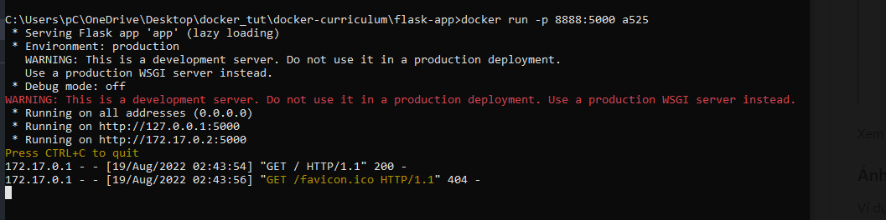
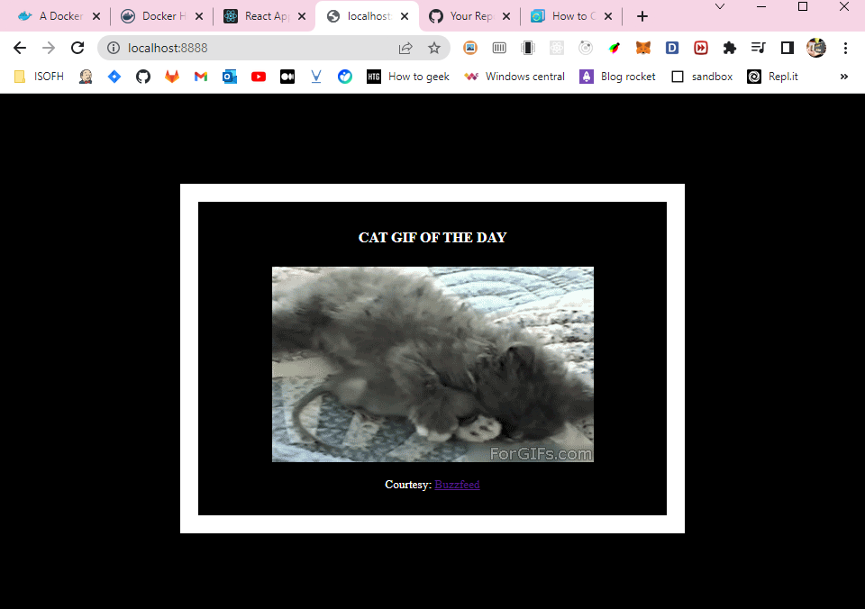

# Docker note

# Table of contents

- [Docker note](#docker-note)
  - [1. Xem các image hiện có:](#1-xem-các-image-hiện-có)
  - [2. Tải image từ trên Docker Hub về](#2-tải-image-từ-trên-docker-hub-về)
  - [3. Xóa image hiện có trên máy](#3-xóa-image-hiện-có-trên-máy)
  - [4. Chạy container với image hiện có trên máy](#4-chạy-container-với-image-hiện-có-trên-máy)
  - [5. Thoát khỏi container khi đang chạy](#5-thoát-khỏi-container-khi-đang-chạy)
  - [6. Xem danh sách container đang chạy](#6-xem-danh-sách-container-đang-chạy)
  - [7. Vào lại container đang chạy](#7-vào-lại-container-đang-chạy)
  - [8. Xóa container](#8-xóa-container)
  - [9. Chạy lại một container đã dừng/ dừng một container đang chạy](#9-chạy-lại-một-container-đã-dừng-dừng-một-container-đang-chạy)
  - [10. Chạy lệnh của container khi đang không trong container đang chạy:](#10-chạy-lệnh-của-container-khi-đang-không-trong-container-đang-chạy)
  - [11. Lưu container thành image với commit](#11-lu-container-thnh-image-vi-commit)
  - [12. Lưu image ra file với docker save](#12-lưu-image-ra-file-vơi-docker-save)
  - [13. Nạp image vào docker từ 1 file](#13-nạp-image-vào-docker-từ-1-file)
  - [14. Ánh xạ thư mục máy host vào container](#14-ánh-xạ-thư-mục-máy-host-vào-container)
  - [15. Chia sẻ dữ liệu ánh xạ từ máy chính vào container này đến container khác](#15-chia-sẻ-dữ-liệu-ánh-xạ-từ-máy-chính-vào-container-này-đến-container-khác)
  - [16. Xem, tạo các ổ đĩa để cho vào container, làm việc.](#16-xem-tạo-các-ổ-đĩa-để-cho-vào-container-làm-việc)
  - [17. Docker Network](#17-docker-network)
  - [18. Thực hành kết nối các container (PHP + MYSQL + APACHE)](#18-thực-hành-kết-nối-các-container-php--mysql--apache)
  - [19. Các lệnh tra cứu thông tin, giám sát hoạt động của image và container](#19-các-lệnh-tra-cứu-thông-tin-giám-sát-hoạt-động-của-image-và-container)
  - [20. Copy dữ liệu từ file nào đó trong máy host vào container đang chạy](#20-copy-dữ-liệu-từ-file-nào-đó-trong-máy-host-vào-container-đang-chạy)
  - [21. Biên tập dockerfile](#21-biên-tập-dockerfile)

Các lệnh:

## 1. Xem các image hiện có:

```cmd
docker images
```

## 2. Tải image từ trên Docker Hub về

```cmd
docker pull image:tag
```

Với `image` là tên image public trên docker hub, `tag` là tên version xem trên docker hub. Nếu không có `:tag` thì mặc định sẽ pull về bản mới nhất ( tương đương vs `:latest`)

Có thể tìm các image hiện có trên Docker Hub bằng cách lên web xem hoặc gõ lệnh

```cmd
docker search image_name
```

Tìm kiếm image có tên `image_name`.

## 3. Xóa image hiện có trên máy

```cmd
docker image rm imagename
```

`imagename` là tên của image, nếu có nhiều verion (nhiều tag thì thêm `imagename:tag`). Có thể thay `imagename` bằng `imageID` ( Xem trên cmd bằng lệnh `docker images`).

**Chú ý :** Nếu không xóa được image bằng id thì dùng `ten:tag` có thể hoạt động được.

Hoặc dùng lệnh:

```cmd
docker rmi imagename
```

`imagename` có thể thay bằng các tham số như lệnh `docker image rm`

## 4. Chạy container với image hiện có trên máy

```cmd
docker run -it --name NAME -h HOST image
```

Với `-it` là kết hợp của `-i` (tương tác với image) `-t` (terminal của image). `NAME` là define tên của container, `HOST` là define tên của host và `image` là tên image dùng.

Chú ý có thể thay tên image bằng id của nó (id chỉ cần chỉ ra một bộ phận, không cần phải tất cả id).

**Có thể dùng lệnh :**

```cmd
docker run -it --name NAME --rm -h HOST image
```

Tham số `rm` được thêm vào sẽ xóa container ngay sau khi ta thoát, không dùng container nữa.

## 5. Thoát khỏi container khi đang chạy

tổ hợp phím `Ctrl P Q`

## 6. Xem danh sách container đang chạy

```cmd
docker ps
```

Xem tất cả các container, cả đang chạy lẫn đã dừng

```cmd
docker ps -a
```

## 7. Vào lại container đang chạy

```cmd
docker attach container
```

`container` là tên container (do mình đặt hoặc mặc định được tự đặt, xem bằng lệnh `docker ps` hoặc `docker ps -a`). Có thể thay tên bằng id của container.

## 8. Xóa container

```cmd
docker rm container
```

`container` là tên hoặc id của container cần xóa.

`container` là tên container hoặc id

Có thể xóa nhiều container cùng 1 lúc bằng cách sau

```cmd
docker rm container1 container2...
```

Với `container1`, `container2` là chỉ định của từng container, mỗi chỉ định cách nhau một dấu cách.

**Nếu như container muốn xóa đạng chạy thì dùng lệnh**

```cmd
docker rm container -f
```

Với `-f` có nghĩa là force (buộc dừng)

**Xóa container bằng cách dùng filer:**

```cmd
docker rm $(docker ps -a -q -f status=exited)
```

Lệnh trên gồm `-q` để chỉ return numeric IDS và `-f` để filter ra các container có `status=exited` để xóa.

Dùng lệnh

```cmd
docker container prune
```

để xóa hết các container

## 9. Chạy lại một container đã dừng/ dừng một container đang chạy

Đầu tiên nên `docker ps -a` để xem tất cả container.

`docker start container_id` để chạy container có id là `container_id`.

- Để dừng một container đang chạy:

```cmd
docker stop container_id
```

Với `container_id` là id của container đang chạy cần dừng.

## 10. Chạy lệnh của container khi đang không trong container đang chạy:

```cmd
docker exec container_name/container_id lenh
```

Hoặc

```cmd
docker exec -it container_name/container_id lenh
```

Lệnh trên tương đương với `attach` container và chạy lệnh trong container.

## 11. Lưu container thành image với commit

```cmd
docker commit ten/id_container ten_image:tag
```

Lưu container với `ten` hoặc `id` thành image có tên `ten_image` với tag là `tag`.

## 12. Lưu image ra file với docker save

```cmd
docker save --ouput tenfile.tar id/ten_image
```

`tenfile.tar` là tệp `.tar` tên là `tenfile` hoặc có thể để `.zip`

`id/ten_image` là id hoặc tên của image cần lưu

## 13. Nạp image vào docker từ 1 file

```cmd
docker load -i tenfile
```

Có thể khi load vào, gõ `docker images` không ra image mới được nạp vào (do không chỉ ra tên và tag của image)

Ta có thể thêm tên vào tag lúc nạp vào xong như sau:

```cmd
docker tag image_id ten:tag
```

Trong đó `image_id` là id của image vừa nạp vào. `ten:tag` là tên và tag ta set cho image.

## 14. Ánh xạ thư mục máy host vào container

```cmd
docker run -it -v pathHost:pathContainer imageid
```

Trong đó `pathHost` là đường dẫn đến thư mục của máy chính đang chạy. `pathContainer` là đường dẫn đến thư mục muốn ánh xạ thư mục từ máy chính vào của container.

**Chú ý đường dẫn trên window:**

**Ví dụ:**

```cmd
docker run -it -v C:/User/pC/OneDrive/Desktop/test:/home/test
```

Ở đây `C:/User/pC/OneDrive/Desktop/test` là đường dẫn trên máy chính ( chú ý để `/` thay vì `\`). `/home` là đường dẫn trên container.

Một khi đã kết nối thì việc thay đổi trong thưc mục ở cả hai phía là như nhau. (cả 2 đều cùng thay đổi).

## 15. Chia sẻ dữ liệu ánh xạ từ máy chính vào container này đến container khác

```cmd
docker run -it --volumes-from tenContainer imageID
```

Câu lệnh trên tạo ra một container mới đc phép lấy dữ liệu từ container có tên `tenContainer`, ta có thể dùng `id` của container cũng đc. Container được tạo ra bởi image có `imageID`...

## 16. Xem, tạo các ổ đĩa để cho vào container, làm việc.

### Xem docker đang có ổ đĩa nào:

```cmd
docker volume ls
```

### Tạo ổ đĩa

```cmd
docker volume create tenODia
```

Tạo ra ổ đĩa với tên `tenODia` trong docker.

### Kiểm tra thông tin ổ đĩa

```cmd
docker volume inspect tenODia
```

### Xóa ổ đĩa

```cmd
docker volume rm tenODia
```

### Gán ổ đĩa vào container

```cmd
docker run -it --name tenContainer --mount source=tenODia,target=pathContainer imageID
```

Câu lệnh trện sẽ tạo ra một container có tên là `tenContainer`, trong container đã được mount vào ổ đĩa tên là `tenODia` với đường dẫn đến ổ đĩa trong container là `pathContainer`. Container được tạo ra từ image có id là `imageID`.

Chú ý khi làm việc với ổ đĩa trong container, khi xóa container, dữ liệu trong ổ đĩa và ổ đĩa vẫn tồn tại. Giống như việc sử dụng ánh xạ dữ liệu từ máy chính vào container.

**Chú ý**: Việc gán ổ đĩa vào container chỉ có thể được thực hiện khi bắt đầu khởi tạo container. Nếu muốn gán ổ đĩa vào một container đã được tạo từ trước thì cần `commit` container đó lại thành một image, Rồi khởi tạo một container mới từ ổ đĩa cần gán và image là container cũ đã được `commit`.

Để gán vào nhiều ổ đĩa:

```cmd
docker run -it --name tenContainer --mount source=tenODia1,target=pathContainer1 --mount source=tenODia2,target=pathContainer2 imageID
```

### Tạo ổ đĩa ánh xạ vào thư mục trên máy chính

```cmd
docker create --opt device=pathHOST --opt type=none --opt o=bind DISKNAME
```

Đối với loại ổ đĩa này thì không thể gán cho container bằng tham số `--mount` mà dùng như sau:

```cmd
docker run -it -v DISKNAME:pathContainer imageId
```

## 17. Docker Network

### Xem docker đang có các mạng nào

```cmd
docker network ls
```

Mặc định thì các container trong docker sẽ được kết nối tới mạng `bridge`



### Xem mạng có những container nào đang kết nối đến.

```cmd
docker network inspect tenMang
```

Kết quả trả về ví dụ:



### Xem container kêt nối đến mạng nào

```cmd
docker inspect tenContainer
```





Xem [Ví dụ](./example/network_busybox) nhỏ về kết nối các container trong cùng mạng với busybox

### Ánh xạ cổng port từ mạng này sang mạng trong docker.

Ví dụ ánh xạ port 80 sang port 8888 của localhost





### Tạo mạng cầu (bridge):

```cmd
docker network create --driver bridge tenMang
```

### Xóa mạng

```cmd
docker network rm tenMang
```

### Chạy container kết nối đến mạng đã tạo thay vì để default

```cmd
docker run -it --name tenContainer --network tenMang imageID
```

### Chạy container, ánh xạ cổng của mạng ngoài đến cổng của mạng do mình tạo

```cmd
docker run -it --name tenContainer --network tenMang -p portHost:portContainer imageID
```

**Lưu ý:** Các container kết nối cùng một mạng mới có thể thực hiện các phương thức trao đổi với nhau.

### Gán mạng tự tạo cho container đang chạy

```cmd
docker network connect tenMang tenContainer
```

Thực hiện lệnh trên sẽ kết nối container có tên `tenContainer` vào mạng `tenMang`. Container có thể kết nối đến nhiều mạng khác nhau. Khi ở trong cùng một mạng, ngoài cách trao đổi dữ liệu với nhau giữa các container thông qua địa chỉ IP, còn có thể dùng tên container để thực hiện...

Tương tự như vậy ta có thể hủy kết nối mạng của container:

```cmd
docker network disconnect tenMang tenContainer
```

## 18. Thực hành kết nối các container (PHP + MYSQL + APACHE)

[Xem ví dụ](./example/mysql_apache_php/)

## 19. Các lệnh tra cứu thông tin, giám sát hoạt động của image và container

### Tra cứu lịch sử của image

```cmd
docker image history idImage
```

### Tra cứu thông tin chi tiết của image

```cmd
docker inspect idImage
```

Có thể thay id của image bằng tên đầy đủ.

Lệnh inspect này dùng tương tự cho container để xem thông tin chi tiết container (Thay id và tên của image thành của container)

### Xem các thay đổi trong container từ lúc tạo ra đến hiện tại

```cmd
docker diff idContainer
```

Có thể thay id bằng tên đầy đủ của container

Lệnh trên sẽ cho biết được container đã thêm, bớt, sửa các thư mục nào...

`C`: Thay đổi

`A`: Thêm mới

`D`: Xóa

### Kiểm tra các hoạt động, thay đổi của container

```cmd
docker logs idContainer
```

Ví dụ muốn kiểm tra một số dòng logs cuối cùng:

```cmd
docker logs --tail soDong idContainer
```

### Tra cứu mức độ sử dụng tài nguyên của máy khi các container đang chạy

```cmd
docker stats idCOntainer1 idCOntainer2...
```

Giám sát các container có id là `idContainer1` , `idContainer2`. Có thể sử dụng tên container. Mỗi container cách nhau dấu cách

Để thực hiện giám sát việc sử dụng của tất cả các container đang chạy

```cmd
docker stats
```

## 20. Copy dữ liệu từ file nào đó trong máy host vào container đang chạy

```cmd
docker cp pathHost nameContainer:pathContainer
```

## 21. Biên tập dockerfile

Các chỉ thị Dockerfile

- `FROM` : mọi Docker file đều có chỉ thị này, chỉ định image cơ sở
- `COPY ADD` : sao chép dữ liệu
- `ENV` : thiết lập biến môi trường
- `RUN` : chạy các lệnh.
- `VOLUME` : gắn ổ đĩa, thư mục
- `USER` : user
- `WORKDIR` : thư mục làm việc
- `EXPOSE` : thiết lập cổng

**Ví dụ**

```Dockerfile
# xây dựng image mới từ image centos:latest (CENTOS 7)
FROM centos:latest

# Cập nhật các gói và cài vào đó HTTPD, HTOP, VIM
RUN yum update -y
RUN yum install httpd httpd-tools -y
RUN yum install epel-release -y \
    && yum update -y \
    && yum install htop -y \
    && yum install vim -y

#Thiết lập thư mục hiện tại
WORKDIR /var/www/html
# Copy tất cả các file trong thư mục hiện tại (.)  vào WORKDIR
ADD . /var/www/html

#Thiết lập khi tạo container từ image sẽ mở cổng 80
# ở mạng mà container nối vào
EXPOSE 80

# Khi chạy container tự động chạy ngay httpd
ENTRYPOINT ["/usr/sbin/httpd"]

#chạy terminate
CMD ["-D", "FOREGROUND"]
```

**Quy tắc viết chỉ thị Dockerfile:**

Ở đây bạn chú ý khi viết các chỉ thị trong Dockerfile thì một chỉ thị có thể viết theo cấu trúc:

```Dockerfile
# Ghi chú chỉ thị
TÊN_CHỈ_THỊ các_tham_số
```

Ví dụ, chỉ thị RUN là chạy một lệnh, muốn chạy lệnh cập nhật của CentOS yum update -y thì viết trong Dockerfile

```Dockerfile
RUN yum update -y
```

**Thực hiện build dockerfile**

Hiện giờ đang có `Dockerfile` với tên `Dockerfile` ở trên, Dockerfile này căn cứ theo các chỉ thị của nó, nó sẽ: xây dựng một image chứa `CentOS`, cài vào đó `Apache HTTPD`, `HTOP, VIM`, copy các file ở thư mục hiện tại vào `/home/code`, khi container tạo ra từ Image mới này thì tự động chạy `/usr/sbin/http` (máy chủ web) và `bash` đồng thời mở `cổng` 80 trên network container nối vào.

Giờ sử dụng file này build ra image xem, image mới sẽ đặt tên là `i-firstserver:version1`, gõ lệnh sau:

```cmd
docker build -t i-firstserver:version1 -f Dockerfile .
```

Sau khi gõ lệnh này, Docker bắt đầu đọc Dockerfile và thực hiện từng bước của chị thị. Nó sẽ tạo container tạm, đưa vào đó các gói, dữ liệu, cấu hình ... theo chỉ thị, mỗi bước này tạo ra một lớp image. Cuối cùng nó tạo ra một image mới có tên và tag do bạn chỉ ra ở trên, lưu trong hệ thống Docker của bạn!.

Build xong, kiểm tra danh sách image sẽ thấy tên này.



Trong quá trình Docker build image mới từ Dockerfile, nó có thể tạo ra các image tạm thời gây rác hệ thống. Để xóa các image tạm này hãy dùng lệnh:

```cmd
docker image prune
```

**Giải thích các tham số của dockerfile:**

`FROM`:

Đây là chỉ thị dùng để chỉ ra image cơ sở để dựng lên image mới. Để xây dựng từ image nào đó thì bạn cần đọc document của Image đó để biết trong đó đang chứa gì, có thể chạy các lệnh gì trong đó ... Ví dụ, nếu bạn chọn xây dựng từ image centos:laste thì bạn bắt đầu bằng hệ điều hành CentOS và bạn có thể cài đặt, cập nhật các gói với yum, ngược lại nếu bạn chọn ubuntu:latest thì trình quản lý gói của nó là APT ...

`ADD`:

Được dùng để thêm thư mục, file vào Image. Cú pháp viết đó là:

```cmd
ADD thư_mục_nguồn thư_mục_đích
```

Trong đó `thư_mục_nguồn` là thư mục ở máy chạy Dockerfile, chứa dữ liệu cần thêm vào. `thư_mục_đích` là nơi dữ liệu được thêm vào ở container.

`ENV`:

Chỉ thị này dùng để thiết lập biến môi trường, như biến môi trường PATH ..., tùy hệ thống hay ứng dụng yêu cầu biến môi trường nào thì căn cứ vào đó để thiết lập.

```cmd
ENV biến giá_trị
```

`RUN`:

Thi hành các lệnh, tương tự bạn chạy lệnh shell trên OS từ terminal.

```cmd
RUN lệnh-và-tham-số-cần-chạy
```

```cmd
RUN ["lệnh", "tham số1", "tham số 2" ...]
```

`VOLUME`:

Chỉ thi tạo một ổ đĩa chia sẻ được giữa các container.

```cmd
VOLUME /dir_vol
```

`USER`:

Bạn thêm user được dùng khi chạy các lệnh ở chỉ thị `RUN CMD WORKDIR`.

```cmd
USER private
```

`WORKDIR`:

Thiết lập thư mục làm việc hiện tại chi các chỉ thị `CMD, ENTRYPOINT, ADD` thi hành.

```cmd
WORKDIR path_current_dir
```

`EXPOSE`

Để thiết lập cổng mà container lắng nghe, cho phép các container khác trên cùng mạng liên lạc qua cổng này hoặc đỉ ánh xạ cổng host vào cổng này.

```cmd
EXPOSE port
```

`ENTRYPOINT, CMD `:

Chạy lệnh trong chỉ thị này khi container được chạy.

```cmd
ENTRYPOINT commnad_script
```

```cmd
ENTRYPOINT ["command", "tham-số", ...]
```

`CMD` ý nghĩa tương tự như `ENTRYPOINT`, khác là lệnh chạy bằng shell của container.

```cmd
CMD command param1 param2
```

Chú ý ở dạng sau của `CMD` thì nó lại là thiết lập tham số cho `ENTRYPOINT`

```cmd
CMD ["tham-số1", "tham-số2"]
```

## 22. Ví dụ cho việc build 1 app thành images để chạy trên máy khác có docker

Tải flask app sau để thực hành:

[Flask app](./docker_tut/flask-app/)

Sau khi có một app hoàn chỉnh, tạo `Dockerfile` để thực hiện các lệnh cần chạy khi đóng gói images.

Trong `Dockerfile`

```Dockerfile
FROM python:3.8
```

Câu lệnh này dùng `FROM` để chỉ ra base image để có thể chạy app đó là `python:3.8`

Tiếp theo, cần copy các files và tải dependencies.

Đầu tiên, ta cần set working dicrectory và copy file như sau:

```Dockerfile
# set a directory for the app
WORKDIR /usr/src/app

# copy all theo files to the container
COPY . .
```

Bây giờ ta thực hiện tải các dependencies

```Dockerfile
RUN pip install --no-cache-dir -r requirements.txt
```

Tiếp theo cần chỉ định ra port chạy app, ta sử dụng port `5000` để chạy flask app

```Dockerfile
EXPOSE 5000
```

Cuối cùng là viết lệnh `cmd` để chạy app. Ta sử dụng `CMD` command để chỉ ra lệnh gì sẽ được chạy để start app.

```Dockerfile
CMD ["python", "./app.py"]
```

Đây là file `Dockerfile` hoàn thiện:

```Dockerfile
FROM python:3.8

# set a directory for the app
WORKDIR /usr/src/app

# copy all the files to the container
COPY . .

# install dependencies
RUN pip install --no-cache-dir -r requirements.txt

# define the port number the container should expose
EXPOSE 5000

# run the command
CMD ["python", "./app.py"]
```

**Tạo image và push lên docker hub:**

Sử dụng lệnh build với syntax:

```cmd
docker build [OPTIONS] PATH | URL | -
```

Với Options:

```cmd
Options:
      --add-host list           Add a custom host-to-IP mapping (host:ip)
      --build-arg list          Set build-time variables
      --cache-from strings      Images to consider as cache sources
      --disable-content-trust   Skip image verification (default true)
  -f, --file string             Name of the Dockerfile (Default is
                                'PATH/Dockerfile')
      --iidfile string          Write the image ID to the file
      --isolation string        Container isolation technology
      --label list              Set metadata for an image
      --network string          Set the networking mode for the RUN
                                instructions during build (default "default")
      --no-cache                Do not use cache when building the image
  -o, --output stringArray      Output destination (format:
                                type=local,dest=path)
      --platform string         Set platform if server is multi-platform
                                capable
      --progress string         Set type of progress output (auto, plain,
                                tty). Use plain to show container output
                                (default "auto")
      --pull                    Always attempt to pull a newer version of
                                the image
  -q, --quiet                   Suppress the build output and print image
                                ID on success
      --secret stringArray      Secret file to expose to the build (only
                                if BuildKit enabled):
                                id=mysecret,src=/local/secret
      --ssh stringArray         SSH agent socket or keys to expose to the
                                build (only if BuildKit enabled) (format:
                                default|<id>[=<socket>|<key>[,<key>]])
  -t, --tag list                Name and optionally a tag in the
                                'name:tag' format
      --target string           Set the target build stage to build.
```

Ta chạy lệnh :

```cmd
docker build -t yourusername/repository .
```

Ở đây `yourusername` và `repository` là `username` và tên `repository` ở trên Docker hub

Sử dụng `.` chính là path dẫn đến `Dockerfile` để thực hiện build.

Sau khi build images lên repository của docker hub. Trên máy khách, thực hiện lệnh sau để chạy thử container:

```cmd
docker run -p 8888:5000 yourusername/repository
```

Đây là lệnh để thực hiện `pull + chạy container`.

Trong đó, command trên sử dụng port `5000` để chạy server inside container. Còn port `8888` là port để truy cập ở bên ngoài. Như vạy t có thể vào `localhost:8888` để xem app chạy





**Để cho người khác có thể pull images của mình đã build:**

* B1: Đăng nhập vào docker hub

```cmd
docker login
```

* B2: Push images lên docker hub

```cmd
docker push yourusername/project_name
```

Ví dụ tk docker hub là `sonhm2329`, project (tên của images đã build) là `catnip`

```cmd
docker push sonhm2329/catnip
```

## 23. Multi-container environments