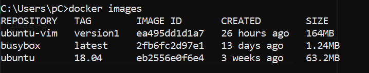
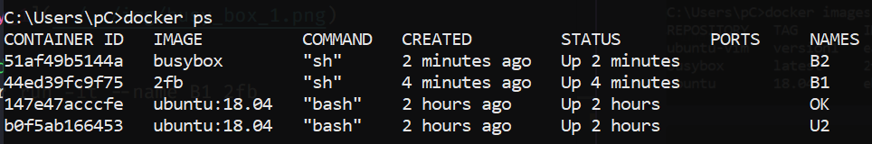
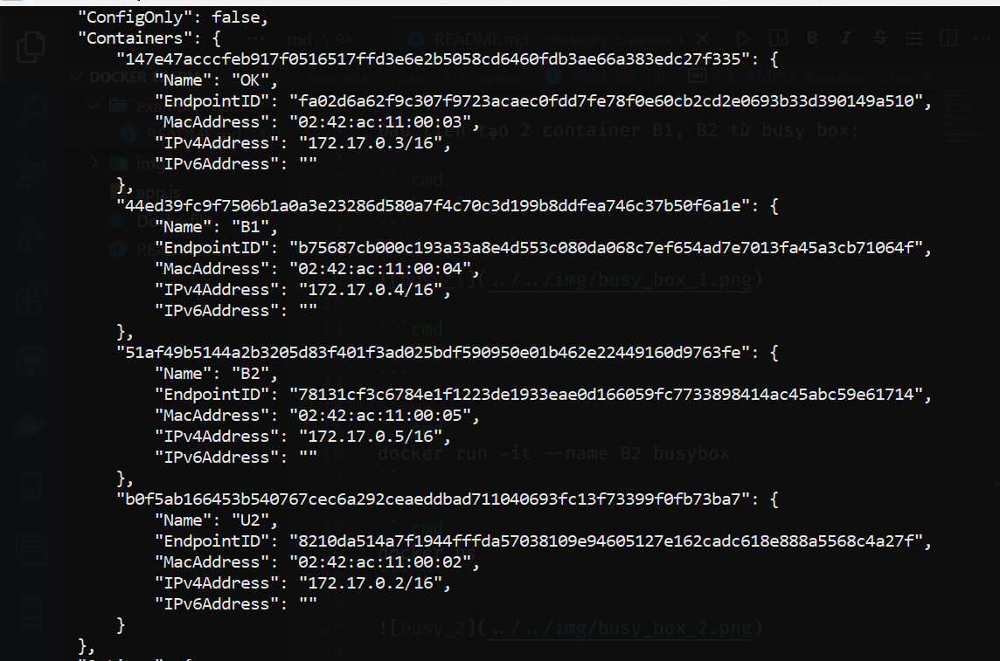
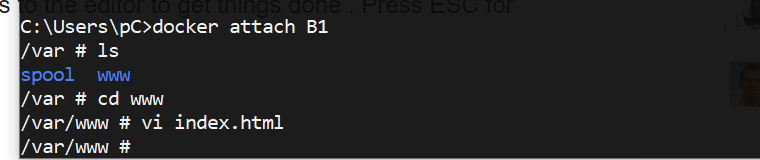
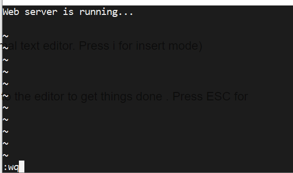
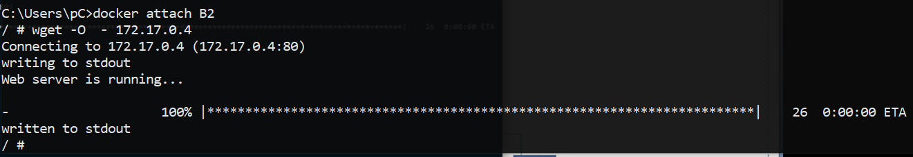

# EXAMPLE busybox network

Đầu tiên tạo 2 container B1, B2 từ busy box:

```cmd
docker images
```



```cmd
docker run -it --name B1 2fb
```

```cmd
docker run -it --name B2 busybox
```

```cmd
docker ps
```



Kiểm tra xem network bridge có đúng là default kết nối với các container hay không:

```cmd
docker network inspect bridge
```



Như vậy 2 container `B1` và `B2` tạo bởi image `busybox` đã kết nối với mạng `bridge`.

Ta thực hiện ví dụ như sau:

- `B1`: Tạo máy chủ server





Viết vào file index.html bằng `vim`. Để kết thúc viết ấn `ESC` và gõ `:wq` (nghĩa là write and quit), viết, lưu và thoát.

Các câu lệnh `vim`: [tài liệu](https://coderwall.com/p/adv71w/basic-vim-commands-for-getting-started)

- `B2`: Tạo máy khách gửi request đến máy chủ `B1`



( Mặc định server chạy ở port 80), địa chỉ IP của server xem bằng lệnh `docker inspect B1`.

Như vậy 2 container đã kết nối được với nhau ( thể hiện ở request từ B2 đến B1 thông qua mạng bridge của docker).